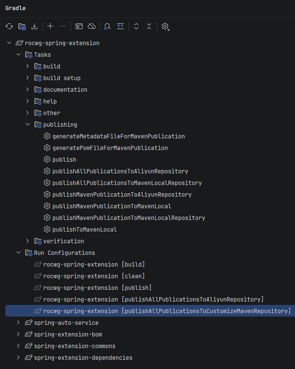

2026年6月26日：

.

这份 IDEA 的 Gradle 面板截图非常经典，它完美展示了一个多模块复合构建项目（Multi-Project Build）在引入了自定义发布插件后的全貌。

我们可以把这个面板拆解为三个核心区域：**全局/根项目任务区（Tasks）**、**运行历史区（Run Configurations）** 以及 **子模块区**。下面为你逐一深度解读它们的来源、功能和实际意义。

## 一、 核心任务区：`publishing`（发布任务组）

这一组任务是在你的模块中应用了 Gradle 官方的 `maven-publish` 插件后，由官方插件**动态注入**进来的。它们的命名遵循 Gradle 官方的严格公式：`publish[发布项名]PublicationTo[仓库名]Repository`。

在你的项目中：

- **发布项（Publication）名称**：`Maven` （来源于官方默认，或你在配置中定义的 `MavenPublication`）。
- **仓库（Repository）名称**：有两个，一个叫 `Aliyun`，一个叫 `MavenLocal`。

### 1. 制品描述文件生成任务（前置任务）

- `generateMetadataFileForMavenPublication`

  - **功能与意义**：生成 `*.module` 文件（Gradle 6+ 专属的现代化依赖元数据文件）。它记录了比 POM 更丰富的变体信息（比如你的 `optional` 依赖变体）。

- `generatePomFileForMavenPublication`

  - **功能与意义**：生成标准的 `pom-default.xml` 文件。这是 Maven 生态的基石，记录了项目的 `GAV` 坐标、依赖列表、开源协议、开发者等。

  > 💡 **注**：这两个任务不需要你手动运行，当你点击下方的发布任务时，它们会被作为前置依赖**自动触发**。

### 2. 全局综合发布任务（大满贯任务）

- `publish`
  - **功能与意义**：**全弹发射**。它会把当前项目下**所有**定义的发布项，推送到**所有**配置的远程仓库中。
  - **注意**：如果切回 `central` 模式，点这个会同时推中央仓和私仓。
- `publishToMavenLocal`
  - **功能与意义**：把所有产物发布到你本地电脑的 `.m2` 仓库（通常在 `C:\Users\用户名\.m2\repository`）。用于本地多项目联调，**不需要网线，速度极快**。

### 3. 精准发布任务（外科手术式精准推送）

- `publishAllPublicationsToAliyunRepository`
- `publishMavenPublicationToAliyunRepository`
  - **功能与意义**：这两条命令是**只推送阿里云效**的专属通道。
  - **核心价值**：当你只想把当前打好的业务 Jar 包送上云效私库，而绝对不想碰本地 `.m2` 或中央仓时，双击它。
- `publishAllPublicationsToMavenLocalRepository`
- `publishMavenPublicationToMavenLocal`
- `publishMavenPublicationToMavenLocalRepository`
  - **功能与意义**：这一组是**只推送本地 `.m2`** 的专属通道。它和全局 `publishToMavenLocal` 的区别在于它更精准，只针对名为 `maven` 的这一个特定装箱项。

## 二、 历史配置区：`Run Configurations`（运行配置）

这个区域不是 Gradle 插件生成的，而是 **IntelliJ IDEA 帮你记录的“快捷播放历史”**。

- **来源**：每当你在任何地方（无论是终端敲命令，还是在面板里双击某个 Task），只要这个任务成功运行过一次，IDEA 就会把它固化在这里，并带上 `[项目名]` 的前缀。
- **功能和意义**：**一键重放**。
  - 你当前高亮选中的 `rocwg-spring-extension [publishAllPublicationsToCustomizeMavenRepository]` 是一条**历史残留的死命令**（因为你在上一轮重构中已经彻底把仓库名从别扭的 `CustomizeMaven` 删改为了标准的 `Aliyun`）。
  - 现阶段，你在这个区里最常用、也最安全的重放命令应该是 `rocwg-spring-extension [publish]`。

## 三、 组织架构区：底部的子模块（Subprojects）

在 `Run Configurations` 下方，整齐排列着 4 个带有 Gradle 图标的目录：

- `spring-auto-service` （自动服务注册模块）
- `spring-extension-bom` （BOM 依赖版本管控制品）
- `spring-extension-commons` （公共业务工具包）
- `spring-extension-dependencies` （全局依赖定义定义）

### 💡 核心意义：根目录 vs 子模块的任务层级关系

- 如果你展开 `spring-extension-commons` 目录，你会发现里面**也有一套一模一样的 `Tasks -> publishing -> publish...` 树状图**。
- **双击根目录（最顶层）的 `publish`**：Gradle 会施展“分身术”，**同时**把这 4 个子模块按照依赖顺序（先编译基础包，再编译组合包）**全部打包并统一发布**。这就是你上一轮看到的 15 秒内全军通过的高效名场面。
- **双击某个子模块内部的 `publish`**：Gradle 只会**孤立地**发布这一个模块，其余模块冷眼旁观。这在日常只想修复一条工具类代码、不想连累其他模块重新上传时，能极大地节省等待时间。

## 📌 总结你的日常最佳操作心智

梳理完这个面板后，你的图形化操作口诀可以精简为两点：

1. **一键发全员**：直接双击最顶层的 `Tasks -> publishing -> publish`。
2. **只想发本地测试**：双击最顶层的 `Tasks -> publishing -> publishToMavenLocal`。

